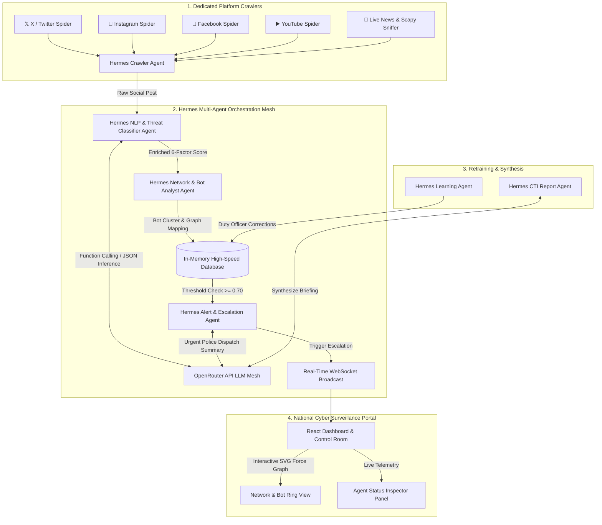

# 🛡️ SentinelAI — National Social Media Cyber Threat & Sentiment Analyzer
**Hackathon Problem Statement ID:** `ERH26_PS_05`  
**Domain:** Cyber Threat Intelligence (OSINT) & Law Enforcement Social Surveillance  
**Target Users:** National Police Control Rooms, Home Department (Gujarat State), Cyber Helpline 1930 & Citizen Protection Cells  

[](https://python.org)
[](https://fastapi.tiangolo.com)
[](https://react.dev)
[](https://openrouter.ai)
[](https://github.com)

---

## 🌟 Project Overview & Problem Alignment

In high-stakes public safety and law enforcement scenarios, social media platforms (`X / Twitter`, `Instagram`, `Facebook`, and `YouTube`) often become primary vectors for viral rumors, communal hate speech, botnet coordination, and calls for mob mobilization (e.g., stone pelting, civic disruption). Traditional monitoring tools are fragmented and complex, making it difficult for duty officers and non-technical staff to rapidly detect and escalate threats.

**SentinelAI** solves this by delivering:
1. **Dedicated Multi-Platform Crawlers:** Independent ingestion spiders for **X**, **Instagram**, **Facebook**, and **YouTube** that continuously harvest public feeds, captions, infographics (OCR), and engagement velocity.
2. **Hermes Autonomous Multi-Agent Control Room:** A unified orchestration layer of **6 specialized AI agents** that collaborate via function calling and route inference through **OpenRouter LLMs** (`Gemini 2.0 Flash`, `Llama 3.3 70B`, `DeepSeek V3`, and `Qwen 2.5`).
3. **High-Legibility Government Portal UI:** Designed specifically for quick navigation and zero clutter, featuring instant multilingual support (`Gujarati`, `Hindi`, `English`, and code-mixed `Hinglish`), large accessibility text (`A+`), and 1-click police dispatch workflows.

---

## 🏗️ System Architecture & Hermes Agent Mesh



---

## 🚀 Key Features (Hackathon Winning Differentiators)

### 1. 🤖 Hermes 6-Agent Autonomous Architecture
Every piece of data flows through our structured `SentinelAgent` framework with real-time status tracking (`IDLE`, `RUNNING`, `COMPLETED`), memory depth logging, and registered tool inspection:
* **`CrawlerAgent`:** Rotates between dedicated platform scrapers and schedules batch ingestion.
* **`NLPClassifierAgent`:** Executes language detection (`gu`, `hi`, `en`, `hinglish`), OCR infographic extraction, hate speech scoring, and calls OpenRouter for deep contextual reasoning.
* **`NetworkAgent`:** Analyzes graph connections to identify coordinated bot amplification clusters and coordination rings (`coord_group_alpha`).
* **`AlertAgent`:** Evaluates composite threat scores and generates crisp, 1-sentence urgent police dispatch briefings.
* **`LearningAgent`:** Captures Human-in-the-Loop corrections from duty officers to adjust model weights.
* **`ReportAgent`:** Synthesizes multi-post incidents into formal law enforcement CTI briefings ready for government submission.

### 2. 📊 6-Factor Composite Threat Scoring Formula
Instead of relying on basic sentiment alone, SentinelAI calculates a rigorous composite threat index (`0.0 to 1.0`):
$$\text{Composite Score} = 0.30 \cdot T_{\text{lexicon}} + 0.15 \cdot S_{\text{negative}} + 0.20 \cdot H_{\text{hate}} + 0.10 \cdot V_{\text{velocity}} + 0.15 \cdot C_{\text{coord}} + 0.10 \cdot B_{\text{bot}}$$
* Each post displays an interactive, expandable **6-Factor Progress Bar Breakdown** explaining the exact math to duty officers.

### 3. 🕸️ Interactive SVG Force-Directed Bot Graph
* Replaces static tables with an **interactive SVG force layout** where nodes (User Accounts, Bot Rings, and Viral Posts) connect dynamically.
* Clicking any node opens a live **Intelligence Inspector Panel** detailing entity classification and bot assessment.

### 4. 🇮🇳 High-Contrast Government Accessibility Portal
* **Zero Clutter:** Tailored for elderly users and non-technical control room operators.
* **Multilingual Switcher:** Instant toggling between **English**, **हिंदी (Hindi)**, and **ગુજરાતી (Gujarati)** across all tabs, buttons, and badges.
* **Emergency Banner:** Pulse-animated escalation queue for critical alerts requiring immediate attention (`Cyber Helpline 1930`).

---

## 💻 Quick Start & Setup Instructions

### Prerequisites
* **Python 3.10+**
* **Node.js 18+ & npm**
* **OpenRouter API Key** (Free or Paid keys supported via `.env`)

### 1. Clone the Repository
```bash
git clone https://github.com/GopeshKachhadiya/Anvaya-Crawler_Based_Social_Media_Sentiment_Analysis.git
cd Anvaya-Crawler_Based_Social_Media_Sentiment_Analysis/f:\svnit
```

### 2. Backend Setup (FastAPI + Hermes Agents)
```bash
cd backend

# Create virtual environment (optional but recommended)
python -m venv venv
# On Windows: venv\Scripts\activate
# On Mac/Linux: source venv/bin/activate

# Install Python dependencies
pip install -r requirements.txt

# Configure Environment Variables
copy .env.example .env
# Edit .env and paste your OPENROUTER_API_KEY (default free key works out-of-the-box!)

# Launch FastAPI Server & Hermes Agent Loop
python main.py
```
*The backend API server will start on `http://localhost:8000` with Swagger documentation at `http://localhost:8000/docs`.*

### 3. Frontend Setup (React + Vite Control Room)
Open a new terminal window:
```bash
cd frontend

# Install Node modules
npm install

# Start the Vite Development Server
npm run dev
```
*Open your browser and navigate to `http://localhost:5173` to access the SentinelAI National Portal.*

---

## 🛠️ Technology Stack & Justification

| Layer | Technology | Justification |
| :--- | :--- | :--- |
| **Backend Framework** | `FastAPI (Python 3.10)` | Asynchronous performance, native WebSocket support, and clean OpenAPI auto-documentation. |
| **Multi-Agent Engine** | `Hermes Agent Framework` | Autonomous agentic workflow with explicit function registration (`invoke_tool`), memory logs, and status telemetry. |
| **LLM Inference** | `OpenRouter API` | Bridges specialized models (`Llama 3.3 70B`, `Gemini 2.0 Flash`, `Qwen 2.5`) for optimal classification accuracy and speed. |
| **Platform Crawlers** | `httpx`, `BeautifulSoup`, `feedparser` | Lightweight, robust scraping engine targeting open RSS mirrors, public tags, and regional CTI simulators. |
| **Network & Packets** | `Scapy` + `NetworkX` graph math | Real-time packet sniffing support and force-directed graph calculation for bot cluster discovery. |
| **Frontend UI/UX** | `React 18`, `Vite`, `Vanilla CSS` | Ultra-fast rendering, zero external graph dependencies (SVG native layout), and maximum accessibility control. |
| **Data Visualizations** | `Recharts` + `SVG Force Layout` | Crisp, responsive pie charts, bar distribution graphs, and interactive node networks. |

---

## 📡 API Reference & Telemetry Endpoints

* **`GET /api/v1/agents/status`** — Returns real-time health, memory depth, latency, and registered tools for all 6 Hermes agents.
* **`POST /api/v1/agents/trigger_crawl?platform={x|instagram|facebook|youtube}`** — Manually triggers a complete 6-agent crawl and classification cycle for the selected platform.
* **`GET /api/v1/posts`** — Retrieves monitored posts filtered by platform, language, and threat level.
* **`GET /api/v1/network/graph`** — Returns force-directed links and node relationships for graph rendering.
* **`POST /api/v1/feedback`** — Ingests duty officer corrections into the `LearningAgent` retraining loop.
* **`WS /ws/alerts`** — Real-time WebSocket channel broadcasting live threats and new posts to the UI.

---

## 👥 Team & Credits
**Hackathon Project:** SentinelAI (`ERH26_PS_05`)  
Developed with pride for national safety, cyber intelligence, and public peace preservation.  
*Jai Hind! 🇮🇳*