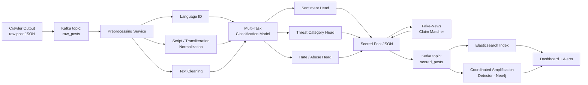

# NLP Threat, Sentiment & Misinformation Module — Build Specification
### For ERH26_PS_05 — Crawler-Based Social Media Threat & Sentiment Analyzer

**Audience note:** this document is written as an implementation spec for an AI coding agent (e.g. Claude Code) to scaffold and build directly — not a human tutorial. It assumes your crawler already works and produces raw posts; this covers everything downstream of that: preprocessing, classification, misinformation handling, serving, and evaluation.

---

## Table of Contents

1. [Scope Reality-Check — Read This Before You Build Anything](#1-scope-reality-check)
2. [System Architecture](#2-system-architecture)
3. [Input Contract From the Crawler](#3-input-contract-from-the-crawler)
4. [Tech Stack — Exact](#4-tech-stack--exact)
5. [Repository Structure](#5-repository-structure)
6. [Preprocessing Pipeline](#6-preprocessing-pipeline)
7. [Datasets & Labeling Schema](#7-datasets--labeling-schema)
8. [Model Architecture](#8-model-architecture)
9. [The Fake-News / Misinformation Sub-System](#9-the-fake-news--misinformation-sub-system)
10. [Training Procedure & Hyperparameters](#10-training-procedure--hyperparameters)
11. [Evaluation Framework](#11-evaluation-framework)
12. [Serving & API Contract](#12-serving--api-contract)
13. [Kafka + Elasticsearch Integration](#13-kafka--elasticsearch-integration)
14. [Coordinated Amplification — Boundary Note](#14-coordinated-amplification--boundary-note)
15. [Human-in-the-Loop & Escalation Logic](#15-human-in-the-loop--escalation-logic)
16. [Time-Boxed Build Priority](#16-time-boxed-build-priority)
17. [Demo Script for Judges](#17-demo-script-for-judges)
18. [Known Limitations to Disclose Proactively](#18-known-limitations-to-disclose-proactively)

---

## 1. Scope Reality-Check

Your problem statement bundles three genuinely different NLP problems under one "sentiment module" label. Separating them — and being honest about what's achievable for each — is what makes your evaluation numbers defensible in front of judges who know NLP.

| # | Task | What it actually is | Solvable off-the-shelf? |
|---|------|---------------------|--------------------------|
| 1 | **Sentiment** (positive / negative / neutral) | Emotional polarity of the text | Yes — well-understood, reliable with fine-tuning |
| 2 | **Threat / intent category** (Inflammatory / Incitement to Violence / Fake News / Neutral) | An *intent/stance* classifier, not sentiment. A post can have calm, neutral *tone* while being a severe incitement to violence — sentiment and threat level are not the same axis | Yes, but needs its own model head and its own labeled data — don't reuse the sentiment head's output as a proxy for threat level |
| 3 | **"Fake News" / truthfulness** | Whether a *claim* is factually true | **No.** This is the part your message conflates with sentiment ("are they true or not"). No text classifier can determine objective truth from text alone — that requires evidence retrieval against a knowledge base (i.e., fact-checking), not classification. Section 9 gives you an honestly-scoped version that's actually buildable in a hackathon timeframe. |

**On the ">90% accuracy" target:** realistic for sentiment (3-class) and binary hate/not-hate on clean data. It's optimistic as a single blended number across all four threat categories, because "Incitement to Violence" will be your rarest class with the fewest training examples and the highest cost of a false negative. Section 11 gives per-class realistic targets and — more usefully — how to report metrics so they read as rigorous rather than inflated. Do not let your pitch deck promise one flat 90%+ number across everything; report per-class and you'll look more credible, not less.

---

## 2. System Architecture



One shared transformer encoder feeds three classification heads (multi-task learning), plus a separate embedding-based claim-matcher for the fake-news signal. Multi-task learning matters here specifically because your Gujarati-labeled data will be scarce (Section 7) — sharing one encoder across tasks lets weaker-resourced tasks borrow statistical strength from stronger ones, and it keeps inference to one forward pass instead of three separate models, which matters for the near-real-time requirement.

---

## 3. Input Contract From the Crawler

This is an assumed schema — adjust field names to match what your crawler actually emits. The only hard requirement is that `text`, `platform`, and `timestamp` are present; everything else is optional enrichment.

```json
{
  "post_id": "string",
  "platform": "x | instagram | facebook | youtube",
  "author_handle": "string",
  "author_id": "string",
  "text": "string — raw post text, caption, or comment",
  "language_hint": "string | null — platform-reported language if available",
  "timestamp": "ISO8601",
  "location_tag": "string | null",
  "hashtags": ["string"],
  "mentions": ["string"],
  "media_urls": ["string"],
  "engagement": {"likes": 0, "shares": 0, "comments": 0, "views": 0}
}
```

Output schema (what the NLP service publishes downstream):

```json
{
  "post_id": "string",
  "sentiment": {"label": "positive | negative | neutral", "confidence": 0.0},
  "threat_category": {
    "label": "Inflammatory | Incitement to Violence | Fake News | Neutral",
    "confidence": 0.0,
    "all_scores": {"Inflammatory": 0.0, "Incitement to Violence": 0.0, "Fake News": 0.0, "Neutral": 0.0}
  },
  "hate_speech": {"flag": true, "confidence": 0.0, "target_group_hint": "string | null"},
  "fake_news_signal": {
    "status": "matched | unverified | not_flagged",
    "matched_claim_id": "string | null",
    "similarity": 0.0
  },
  "language_detected": "hi | gu | en | hi-en-mixed | gu-en-mixed",
  "requires_human_review": true,
  "model_version": "string",
  "processed_at": "ISO8601"
}
```

---

## 4. Tech Stack — Exact

```
Python 3.11
torch >= 2.2.0
transformers >= 4.41.0
datasets >= 2.19.0
sentence-transformers >= 3.0.0
scikit-learn >= 1.4.0
fastapi >= 0.111.0
uvicorn[standard] >= 0.29.0
pydantic >= 2.7.0
indic-nlp-library >= 0.92
ai4bharat-transliteration >= 1.1.0
confluent-kafka >= 2.4.0
elasticsearch >= 8.13.0
langdetect >= 1.0.9
fasttext >= 0.9.2
pandas >= 2.2.0
numpy >= 1.26.0
onnxruntime >= 1.18.0
```

Versions above are indicative — pin actual latest-compatible releases from PyPI at implementation time rather than trusting these numbers blindly.

**Base models (verify license and exact tokenizer config on Hugging Face before pulling — don't take names on faith):**

| Component | Recommended model | Why |
|---|---|---|
| Shared encoder (primary) | `google/muril-base-cased` | Purpose-built for 17 Indian languages including Hindi and Gujarati; explicitly trained on both native-script *and* romanized/transliterated text — that's exactly your Hinglish/code-mixing problem |
| Shared encoder (higher capacity) | `google/muril-large-cased` | Same coverage, more capacity, if GPU budget allows |
| Code-mixed specialist | `l3cube-pune/hing-bert` or `l3cube-pune/hing-roberta` | Pretrained specifically on Hindi-English code-mixed social text; good ensemble member or Hinglish-heavy fallback |
| Lightweight alternative | `ai4bharat/indic-bert` | Smaller (ALBERT-based), faster inference if latency is tight |
| Broad multilingual fallback | `xlm-roberta-base` | Strong general baseline, useful for comparison |
| Sentence embeddings (claim-matching) | `sentence-transformers/LaBSE` or `intfloat/multilingual-e5-base` | Cross-lingual semantic similarity for the fake-news matcher (Section 9) |

---

## 5. Repository Structure

```
nlp-service/
  app/
    main.py                 # FastAPI entrypoint
    config.py
    schemas.py              # pydantic request/response models
    preprocessing/
      lang_id.py
      normalize.py
      transliteration.py
      clean.py
    models/
      multi_task_model.py   # shared encoder + heads
      inference.py
      load_checkpoint.py
    training/
      train.py
      dataset.py
      augment.py
      losses.py             # focal loss, class-weighted CE
      metrics.py
    fake_news/
      claim_db.py
      embedder.py
      similarity_match.py
  data/
    raw/
    processed/
    claim_db.jsonl
  notebooks/
    eda.ipynb
    error_analysis.ipynb
  tests/
    test_preprocessing.py
    test_inference.py
  requirements.txt
  Dockerfile
  README.md
```

---

## 6. Preprocessing Pipeline

### 6.1 Language & Script Identification
Off-the-shelf language ID tools (`langdetect`, `fasttext lid.176`) are trained mostly on monolingual, formal text and degrade badly on short, code-mixed social posts. Plan for this explicitly:

- Run `fasttext lid.176` as a first-pass guess.
- For short posts (under ~15 tokens) or posts flagged as mixed, fall back to a **token-level** language tag rather than a single document-level label — tag each token as Hindi / Gujarati / English / Named-entity, then derive a document-level `hi-en-mixed` / `gu-en-mixed` label from the token distribution.
- Do not trust `language_hint` from the platform alone — cross-check it against your own detector, since platforms frequently mislabel code-mixed content as a single language.

### 6.2 Transliteration Normalization
Romanized Hindi/Gujarati ("kya kar rahe ho", "su thay") needs to be handled without forcing a full script conversion, since MuRIL and similar models are trained to handle romanized input directly. Use `ai4bharat-transliteration` (IndicXlit) only where you need a canonical native-script form (e.g., for the claim-matching layer, where consistent script improves embedding similarity) — for classification, feeding romanized text directly into MuRIL is fine and often better than force-converting it, since forced transliteration introduces its own errors.

### 6.3 Text Cleaning Rules
- Strip URLs, replace with a `[URL]` token (URLs carry little classification signal but eat sequence length).
- Keep hashtags and mentions as tokens rather than stripping them — hashtag co-occurrence is a real signal for coordinated campaigns downstream.
- Normalize repeated characters (e.g., elongated words used for emphasis) to at most 2 repeats — helps generalization without destroying emphasis signal entirely.
- Preserve emoji — do not strip them. Emoji carry real sentiment/threat signal in this domain; map them to short text descriptors only if your tokenizer's vocabulary doesn't already handle them natively (most modern tokenizers do).

### 6.4 Code-Mixing & Obfuscation
Two known, real challenges in this space, worth testing for explicitly in your error analysis rather than assuming they're solved:
- **Intentional obfuscation**: character substitution or spacing tricks used to evade keyword-based filters. Your model should be more robust to this than a keyword-matching system by design (that's the whole point of using a transformer rather than a blocklist) — but validate it specifically with a held-out set of obfuscated examples rather than assuming robustness.
- **Regional slang and transliteration variants**: rather than trying to enumerate slang terms yourself, treat this as a data problem — run frequency analysis on out-of-vocabulary / high-uncertainty tokens from your *own* crawled corpus, and have a native-speaker team member annotate the most frequent ones. Your team's own linguistic knowledge of Gujarati/Hindi/Hinglish is a better source of ground truth here than any external list.

---

## 7. Datasets & Labeling Schema

### 7.1 Public datasets to start from
- **HASOC** (Hate Speech and Offensive Content Identification, FIRE shared task, Hindi track, multiple years) — hate/offensive labeled Hindi social text.
- **TRAC** (Trolling, Aggression and Cyberbullying shared tasks) — Hindi-English code-mixed Facebook/YouTube comments labeled for aggression (overtly aggressive / covertly aggressive / non-aggressive) — very close to your "Inflammatory" category.
- **L3Cube-HingCorpus** — large unlabeled Hindi-English code-mixed corpus, useful for domain-adaptive pretraining (Section 10.3) rather than direct fine-tuning.
- **IndicCorp / IndicNLP corpora** (AI4Bharat) — large unlabeled multi-language corpora including Gujarati, same use case.

Treat exact current availability/licensing of each as something to verify yourself when you go to pull them — dataset hosting and access terms change, and I haven't checked current status of any of these.

### 7.2 The Gujarati Data Gap
Be direct with your team about this: labeled Gujarati hate-speech/threat data is meaningfully scarcer than Hindi. Two practical strategies, both worth doing rather than picking one:
1. **Cross-lingual transfer**: fine-tune on Hindi-labeled data using MuRIL/XLM-R (both have genuine Gujarati pretraining exposure), then fine-tune further on whatever Gujarati-labeled data you can manually annotate during the hackathon — even 500–1000 examples meaningfully helps when starting from a good multilingual checkpoint.
2. **Silver-label bootstrapping**: back-translate Hindi-labeled examples into Gujarati via a translation model to generate noisy ("silver") Gujarati training data, explicitly flagged as noisier than hand-labeled data in your training pipeline (e.g., down-weighted in the loss).

Report Gujarati performance **separately** from Hindi/Hinglish in your results — don't blend them into one aggregate number, since that would hide a real and predictable weak spot.

### 7.3 Labeling Schema
Define categories behaviorally, not by example phrases — your actual labeled training examples should come from the datasets above and your annotators, not from invented sample text.

| Category | Definition |
|---|---|
| Neutral | Informational or everyday content; no identity-targeting or threat signal |
| Inflammatory | Provocative content that targets a group's identity or emotion (e.g., us-vs-them framing, identity-based blame) without a direct call to action |
| Incitement to Violence | Explicit or strong implicit call to commit violence or harm against a person, group, or location |
| Fake News | Content matching a known false-claim pattern, or an unverifiable claim presented with urgency/authority markers typical of misinformation forwards |

For annotation guidelines, have at least two annotators label a shared sample and report **Cohen's kappa** inter-annotator agreement before trusting the labels — low agreement usually means your category definitions need tightening, and this number itself is something judges will respect seeing in your documentation.

### 7.4 Data Augmentation
- Back-translation (Hindi → English → Hindi) for paraphrase-based augmentation.
- Synonym replacement via multilingual word embeddings or Indic WordNet.
- Code-switch augmentation: randomly transliterate a portion of tokens in a training example to simulate additional code-mixing variety.
- Avoid SMOTE-style embedding-space oversampling for text — it doesn't translate well from tabular data and tends to produce unrealistic synthetic examples. Prefer raw-text augmentation plus class-weighted loss (Section 10) for handling imbalance.

---

## 8. Model Architecture

Single shared encoder, three task-specific classification heads:

```python
import torch
import torch.nn as nn
from transformers import AutoModel

class MultiTaskThreatClassifier(nn.Module):
    def __init__(self, encoder_name="google/muril-base-cased",
                 n_sentiment=3, n_threat=4, n_hate=2, dropout=0.2):
        super().__init__()
        self.encoder = AutoModel.from_pretrained(encoder_name)
        hidden_size = self.encoder.config.hidden_size
        self.dropout = nn.Dropout(dropout)
        self.sentiment_head = nn.Linear(hidden_size, n_sentiment)
        self.threat_head = nn.Linear(hidden_size, n_threat)
        self.hate_head = nn.Linear(hidden_size, n_hate)

    def forward(self, input_ids, attention_mask, token_type_ids=None):
        outputs = self.encoder(
            input_ids=input_ids,
            attention_mask=attention_mask,
            token_type_ids=token_type_ids,
        )
        pooled = outputs.last_hidden_state[:, 0]  # [CLS] representation
        pooled = self.dropout(pooled)
        return {
            "sentiment_logits": self.sentiment_head(pooled),
            "threat_logits": self.threat_head(pooled),
            "hate_logits": self.hate_head(pooled),
        }
```

Tokenization:

```python
from transformers import AutoTokenizer

tokenizer = AutoTokenizer.from_pretrained("google/muril-base-cased")

def tokenize_batch(texts, max_length=128):
    return tokenizer(
        texts, padding=True, truncation=True,
        max_length=max_length, return_tensors="pt",
    )
```

`max_length=128` is a reasonable default for short social posts — check the 95th percentile token length of your *actual* crawled data before finalizing this number.

---

## 9. The Fake-News / Misinformation Sub-System

This is the part worth building carefully rather than faking, because it's the one most likely to fall apart under judge questioning if oversold.

### 9.1 Why a classifier can't do this alone
A model can learn *stylistic* patterns correlated with misinformation (urgency language, unverifiable authority claims, "forward this to everyone" markers) — but it cannot know whether a specific claim is true, because truth is a fact about the world, not a property of sentence structure. Treating "Fake News" as a 4th class in a single classifier alongside Sentiment-adjacent categories, and reporting one accuracy number for it, will overstate what you've built.

### 9.2 The honest, buildable version: claim-matching
Instead of claiming general fact-verification, build a **known-misinformation matcher**:

1. Your team manually curates a claim database — 100–300 claims your team has verified as false or misleading, sourced from established Indian fact-checking bodies (e.g., Alt News, Boom Live, PIB Fact Check) or your own verification.
2. Embed each claim with a multilingual sentence encoder.
3. At inference time, embed the incoming post and check cosine similarity against the claim database.
4. Above a similarity threshold → flag as **"Matches known misinformation pattern"** (not "False" — label it for what it actually is).
5. Below threshold but still stylistically suspicious (per 9.1's stylistic classifier) → flag as **"Unverified — recommend manual fact-check"**, not a truth/false determination.

```python
from sentence_transformers import SentenceTransformer, util
import json

embedder = SentenceTransformer("sentence-transformers/LaBSE")

class ClaimMatcher:
    def __init__(self, claim_db_path):
        self.claims = self._load_claims(claim_db_path)
        self.claim_embeddings = embedder.encode(
            [c["text"] for c in self.claims], convert_to_tensor=True
        )

    def _load_claims(self, path):
        with open(path) as f:
            return [json.loads(line) for line in f]

    def match(self, post_text, threshold=0.75):
        post_embedding = embedder.encode(post_text, convert_to_tensor=True)
        scores = util.cos_sim(post_embedding, self.claim_embeddings)[0]
        best_idx = int(scores.argmax())
        best_score = float(scores[best_idx])
        if best_score >= threshold:
            return {
                "status": "matched",
                "matched_claim_id": self.claims[best_idx]["id"],
                "similarity": round(best_score, 3),
            }
        return {"status": "unverified", "matched_claim_id": None, "similarity": round(best_score, 3)}
```

Claim database format (`claim_db.jsonl`, one JSON object per line):

```json
{"id": "claim_0001", "text": "<paraphrased text of a claim your team has verified as false>", "source": "<fact-checking source used>", "date_flagged": "YYYY-MM-DD"}
```

This design gives you concrete, explainable, demo-able functionality — high precision on claims you've actually curated — without dishonestly claiming to have solved general automated fact-checking, which is an open research problem.

---

## 10. Training Procedure & Hyperparameters

### 10.1 Hyperparameters (starting points — tune from here)
| Parameter | Starting value |
|---|---|
| Learning rate | 2e-5 to 5e-5 |
| Batch size | 16–32 (use gradient accumulation if GPU-memory-limited) |
| Epochs | 3–5, with early stopping on validation macro-F1 |
| Max sequence length | 128 (verify against your data's actual length distribution) |
| Optimizer | AdamW, weight decay 0.01 |
| LR schedule | Linear warmup (~10% of steps) + linear decay |
| Task loss weights | Sentiment 1.0 / Threat 1.5 / Hate 1.0 — threat weighted higher since it's your core deliverable; tune from validation performance |
| Focal loss gamma | 2.0 starting point, tune 1.0–3.0 |
| Class weights | Inverse frequency, capped (e.g., at 10x) to avoid over-weighting the rarest class into instability |

### 10.2 Loss function

```python
import torch
import torch.nn as nn
import torch.nn.functional as F

class FocalLoss(nn.Module):
    def __init__(self, gamma=2.0, weight=None):
        super().__init__()
        self.gamma = gamma
        self.weight = weight

    def forward(self, logits, targets):
        ce_loss = F.cross_entropy(logits, targets, weight=self.weight, reduction="none")
        pt = torch.exp(-ce_loss)
        focal_loss = ((1 - pt) ** self.gamma) * ce_loss
        return focal_loss.mean()
```

Use focal loss specifically for the threat-category head (where "Incitement to Violence" will be rare) — plain cross-entropy tends to let the model ignore rare classes entirely in favor of the majority class.

### 10.3 Training loop skeleton

```python
from torch.utils.data import DataLoader
from torch.optim import AdamW
from transformers import get_linear_schedule_with_warmup

def train(model, train_dataset, val_dataset, epochs=4, batch_size=16, lr=3e-5,
          sentiment_weight=1.0, threat_weight=1.5, hate_weight=1.0):
    train_loader = DataLoader(train_dataset, batch_size=batch_size, shuffle=True)
    val_loader = DataLoader(val_dataset, batch_size=batch_size)

    optimizer = AdamW(model.parameters(), lr=lr, weight_decay=0.01)
    total_steps = len(train_loader) * epochs
    scheduler = get_linear_schedule_with_warmup(
        optimizer, num_warmup_steps=int(0.1 * total_steps), num_training_steps=total_steps
    )

    # Define these from your actual class distributions before training:
    sentiment_loss_fn = nn.CrossEntropyLoss(weight=sentiment_class_weights)
    threat_loss_fn = FocalLoss(gamma=2.0, weight=threat_class_weights)
    hate_loss_fn = nn.CrossEntropyLoss(weight=hate_class_weights)

    best_val_f1 = 0.0
    for epoch in range(epochs):
        model.train()
        for batch in train_loader:
            optimizer.zero_grad()
            outputs = model(batch["input_ids"], batch["attention_mask"])
            loss = (
                sentiment_weight * sentiment_loss_fn(outputs["sentiment_logits"], batch["sentiment_label"])
                + threat_weight * threat_loss_fn(outputs["threat_logits"], batch["threat_label"])
                + hate_weight * hate_loss_fn(outputs["hate_logits"], batch["hate_label"])
            )
            loss.backward()
            torch.nn.utils.clip_grad_norm_(model.parameters(), 1.0)
            optimizer.step()
            scheduler.step()

        val_f1 = evaluate_on_validation(model, val_loader)  # see Section 11
        if val_f1 > best_val_f1:
            best_val_f1 = val_f1
            torch.save(model.state_dict(), "best_model.pt")
```

This is a skeleton — fill in the class-weight tensors from your label distribution and implement `evaluate_on_validation()` per Section 11.

### 10.4 Domain-adaptive pretraining (worthwhile accuracy boost if time allows)
Before fine-tuning on labeled data, continue masked-language-model pretraining of your chosen encoder on **unlabeled** in-domain text — i.e., raw posts your own crawler has already collected. Models pretrained mostly on formal text (news, Wikipedia) underperform on informal social-media style; a few epochs of continued pretraining on your own domain's text before fine-tuning typically gives a real accuracy boost for comparatively little effort, and it directly uses an asset you already have (your crawler's output).

---

## 11. Evaluation Framework

### 11.1 Why accuracy alone is misleading here
With a 4-class problem where "Neutral" will dominate the class distribution, a model can score high raw accuracy while having near-zero recall on "Incitement to Violence" — the class that matters most. Report **macro-F1** and **per-class precision/recall** alongside accuracy, always.

```python
from sklearn.metrics import classification_report, confusion_matrix

def evaluate(y_true, y_pred, label_names):
    print(classification_report(y_true, y_pred, target_names=label_names, digits=3))
    print("Confusion matrix:\n", confusion_matrix(y_true, y_pred))
    return classification_report(y_true, y_pred, target_names=label_names, output_dict=True)
```

### 11.2 Test set construction
- Stratified split by class, **plus** a temporal holdout (train on older posts, test on more recent ones) — social-media threat classifiers commonly overfit to the specific hashtags/vocabulary of whatever viral event they were trained on, and a temporal split is the only way to catch that before a judge does.
- Build a human-adjudicated gold test set of at least 300–500 examples per language variety (Hindi, Gujarati, Hinglish), labeled by 2+ annotators, with inter-annotator agreement reported.

### 11.3 Bias / fairness slice testing
Explicitly test false-positive rates for "Inflammatory"/"Incitement to Violence" labels across posts referencing different religious, caste, or community identifiers. This is a well-documented failure mode in hate-speech detection research generally (models trained on biased annotator judgments over-flagging minority-dialect speech as toxic) — the equivalent risk applies here. Build a small stratified test slice per group and report false-positive rate per slice, not just an aggregate number. This is both good engineering and something that will read as more rigorous to any judge familiar with the space.

### 11.4 Realistic accuracy targets (ballpark, not benchmark citations — verify anything you plan to cite)

| Subtask | Realistic range with careful engineering | Notes |
|---|---|---|
| Sentiment (3-class) | 80–90% accuracy | Achievable with good fine-tuning and clean labels |
| Hate/Abusive (binary) | Roughly 0.75–0.85 macro-F1 | This is the rough range top systems land in on shared tasks like HASOC, from general recollection — treat as a ballpark. Raw accuracy can look higher due to class imbalance; macro-F1 is the honest number |
| Threat Category (4-class, incl. rare violence-incitement) | Roughly 70–85% macro-F1 blended; incitement-to-violence recall is the hard part | Report per-class, not one blended number |
| Fake-news flag (claim-matching) | High precision achievable (>90%) on claims actually in your database | Bounded by database size; this is pattern-matching, not general truth detection — say so |

### 11.5 Techniques to push accuracy up (in priority order)
1. Start from the best available pretrained encoder rather than training from scratch.
2. Domain-adaptive pretraining on your own crawled unlabeled text (Section 10.4).
3. Clean labels — inter-annotator agreement matters more than model size; label noise is usually the real ceiling.
4. Class-weighted / focal loss for imbalance.
5. Data augmentation (back-translation, code-switch augmentation).
6. Ensembling 2–3 models (e.g., MuRIL + XLM-R + a code-mixed specialist) with soft-voting — often a few real points of improvement, at the cost of added latency and complexity; worth it for the reported number, worth flagging as a trade-off in your docs.
7. Per-class threshold tuning on the validation set rather than naive argmax — especially for "Incitement to Violence," where recall matters more than precision.
8. Active learning: have annotators review the model's lowest-confidence predictions and feed corrections back into training — efficient use of a limited labeling budget.

---

## 12. Serving & API Contract

```python
from fastapi import FastAPI
from pydantic import BaseModel

app = FastAPI()

class PostIn(BaseModel):
    post_id: str
    platform: str
    text: str
    language_hint: str | None = None

class ClassificationOut(BaseModel):
    post_id: str
    sentiment: dict
    threat_category: dict
    hate_speech: dict
    fake_news_signal: dict
    requires_human_review: bool

@app.post("/classify", response_model=ClassificationOut)
async def classify_post(post: PostIn):
    cleaned = preprocess(post.text)
    result = model_infer(cleaned)
    return build_response(post.post_id, result)
```

Add a `/classify_batch` endpoint accepting a list of posts for throughput — the batching pattern in Section 13 relies on this.

**Latency**: for the near-real-time requirement, target under ~200ms p95 on CPU (or under ~50ms on GPU) per post. Use ONNX export + int8 quantization of the final trained model for production inference — this is a meaningful speedup with a small, generally acceptable accuracy trade-off, and directly serves the "near-real-time" functional requirement.

---

## 13. Kafka + Elasticsearch Integration

Micro-batch consumption pattern (illustrative, not tested end-to-end — adapt to your actual Kafka setup):

```python
from confluent_kafka import Consumer, Producer
import json

consumer = Consumer({
    "bootstrap.servers": "localhost:9092",
    "group.id": "nlp-classifier-group",
    "auto.offset.reset": "earliest",
})
consumer.subscribe(["raw_posts"])
producer = Producer({"bootstrap.servers": "localhost:9092"})

BATCH_SIZE = 32
buffer = []

while True:
    msg = consumer.poll(timeout=1.0)
    if msg is None:
        if buffer:
            process_and_publish(buffer, producer)
            buffer = []
        continue
    if msg.error():
        continue
    buffer.append(json.loads(msg.value()))
    if len(buffer) >= BATCH_SIZE:
        process_and_publish(buffer, producer)
        buffer = []
```

Micro-batching (32–64 posts every 1–2 seconds) gives you real throughput gains over one-at-a-time inference without sacrificing the "near-real-time" feel the requirements ask for.

Elasticsearch index mapping:

```json
{
  "mappings": {
    "properties": {
      "post_id": {"type": "keyword"},
      "platform": {"type": "keyword"},
      "text": {"type": "text"},
      "language_detected": {"type": "keyword"},
      "sentiment_label": {"type": "keyword"},
      "threat_category": {"type": "keyword"},
      "threat_confidence": {"type": "float"},
      "hate_speech_flag": {"type": "boolean"},
      "fake_news_status": {"type": "keyword"},
      "location_tag": {"type": "keyword"},
      "timestamp": {"type": "date"},
      "requires_human_review": {"type": "boolean"}
    }
  }
}
```

---

## 14. Coordinated Amplification — Boundary Note

Bot/coordinated-amplification detection (functional requirement III) is **not an NLP task** — it's graph and temporal-pattern analysis (posting velocity, account-age distribution, content-similarity clustering, network structure), which is why the suggested tools list puts it under Neo4j rather than the NLP stack. The NLP module's job here is limited to exporting clean, structured features (threat scores, content-similarity embeddings) that the graph layer consumes as input signals — it doesn't need to detect coordination itself. Keep this boundary explicit in your architecture docs so judges don't expect the sentiment module to do a job that belongs to a different subsystem.

---

## 15. Human-in-the-Loop & Escalation Logic

The problem statement's own framing ("alert analysts," "incident summary reports for rapid response") already implies a human-in-the-loop design — make that explicit rather than building anything that auto-acts:

- Only route "Incitement to Violence" or "Fake News" flags above a high-confidence threshold (e.g., >0.85) to the real-time alert queue; everything else queues for analyst batch review.
- The system's job is to prioritize analyst attention, never to take autonomous action (no auto-blocking, no auto-reporting).
- Log analyst corrections and periodically fold them back into training (active learning per Section 11.5) — this is your accuracy-improvement flywheel over time, not just a one-time train/deploy cycle.

---

## 16. Time-Boxed Build Priority

If you're working against a hackathon clock, build in this order — get the full pipeline working end-to-end before polishing any single piece:

1. Baseline sentiment + threat classifier working end-to-end on a small labeled set (integration before perfection).
2. Add the hate-speech head.
3. Add fake-news claim-matching, even with a small curated claim database (50 claims beats zero).
4. Polish accuracy via augmentation/ensembling if time remains (Section 11.5).
5. Add human-in-the-loop review flagging (Section 15).
6. Write the documentation deliverable — Section 18's limitations list gives you a head start on this.

---

## 17. Demo Script for Judges

For your sample-dataset demonstration, pull labeled examples directly from HASOC/TRAC test splits (already vetted and categorized) rather than authoring new example posts for the violent-incitement category — this keeps your demo credible and avoids the ambiguity of self-authored severe content. Structure the demo as: a mixed batch of posts → live classification → dashboard showing the threat-level breakdown → one example of the fake-news claim-matcher correctly flagging a known claim → one example of "unverified, recommend manual review" to show you're not overclaiming certainty.

---

## 18. Known Limitations to Disclose Proactively

Use this directly in your required documentation deliverable ("platform coverage, NLP models, scoring") — disclosing these upfront reads as rigor, not weakness:

- Gujarati-language performance will likely lag Hindi/English due to less labeled data and pretrained-model coverage — report per-language metrics, don't blend them.
- The "Fake News" flag is a known-claim-matching system, not a general truth oracle — label it in the UI as "Matches known misinformation pattern," not "False."
- The rarest class (Incitement to Violence) will have wider confidence intervals given limited training examples — treat automatic alerts as prioritization signals for human review, not final determinations.
- Code-mixed/transliterated text handling will have edge cases (heavy slang, intentional obfuscation) that reduce recall — document your actual observed failure modes from error analysis rather than asserting the problem is solved.
- Coordinated-amplification detection accuracy depends on how much network data the crawler layer can actually retrieve (API rate limits, platform access restrictions) — that's a crawler-layer constraint, not an NLP-layer one, and worth stating as such.
